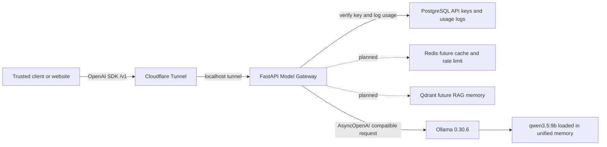
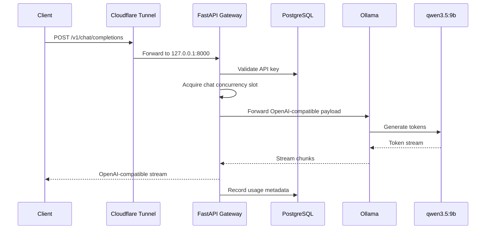

# AI Home Lab API Gateway Case Study

Status: production home-lab deployment  
Primary date: 2026-06-05  
Last verified: 2026-06-06

## Executive Summary

This case study documents a private AI home-lab platform built around a FastAPI model gateway, local Ollama inference, Cloudflare Tunnel ingress, and PostgreSQL-backed API key governance. The system exposes an OpenAI-compatible `/v1` API to trusted applications while keeping the Mac, Ollama, PostgreSQL, Redis, and Qdrant off the public internet.

The goal was practical: run a personal AI API gateway that can serve up to 10 concurrent chat callers at the gateway boundary, keep the local model loaded to reduce first-token delay, and provide a production-shaped path for future RAG, agents, rate limiting, usage tracking, and model routing.

## Problem

The lab needed one stable API contract for multiple clients:

- Website and agent clients should use the familiar OpenAI SDK contract.
- Ollama should stay local and private.
- Public ingress should avoid opening inbound ports on macOS.
- Production and development stacks should not share ports, env files, or runtime state.
- Local unified memory should be protected from uncontrolled model loading.
- A burst of chat users should fail cleanly instead of overwhelming the model runtime.

## Platform Snapshot

| Layer | Current choice |
| --- | --- |
| **Hardware** | Apple Silicon MacBook Pro, M1 Pro, 32 GB unified memory |
| **Public ingress** | Cloudflare Tunnel to `127.0.0.1:8000` |
| **API gateway** | FastAPI, Python 3.14, uv |
| **API contract** | OpenAI-compatible `/v1` routes |
| **Model runtime** | Ollama official Darwin release `0.30.6` |
| **Default model** | `qwen3.5:9b` |
| **Container runtime** | Podman Compose, Docker Compose-compatible scripts |
| **Data plane** | PostgreSQL, Redis, Qdrant |
| **Auth** | PostgreSQL-backed API keys plus admin secret for admin routes |
| **Production port** | `127.0.0.1:8000` |
| **Development port** | `127.0.0.1:8010` |

## Target Architecture



The important design choice is that Cloudflare is only the public edge. The Mac remains a private server. The tunnel targets the gateway on localhost, and Ollama is not exposed directly.

## Request Flow



## Implementation Decisions

### 1. FastAPI as the Control Plane

The gateway owns the stable API contract, auth context, request logging, usage records, and client-facing error shape. Ollama is treated as a private model provider behind this boundary instead of something client applications call directly.

Supported public model routes include:

- `GET /v1/models`
- `GET /v1/models/{model}`
- `POST /v1/chat/completions`
- `POST /v1/completions`
- `POST /v1/embeddings`
- `POST /v1/responses`
- `POST /v1/images/generations`

### 2. AsyncOpenAI Wrapper for Ollama

The Ollama client uses the OpenAI-compatible SDK surface with an `httpx` async client underneath. This keeps the gateway compatible with normal OpenAI-style payloads while still forwarding Ollama-specific options through `extra_body`.

Key runtime settings:

```env
OLLAMA_KEEP_ALIVE=-1
OLLAMA_CHAT_CONCURRENCY_LIMIT=10
OLLAMA_CHAT_ACQUIRE_TIMEOUT_SECONDS=0.25
OLLAMA_REQUEST_TIMEOUT_SECONDS=300
OLLAMA_HTTP_MAX_CONNECTIONS=20
OLLAMA_HTTP_MAX_KEEPALIVE_CONNECTIONS=10
```

### 3. Gateway Concurrency Limit

The gateway uses a bounded async semaphore for chat requests. This allows up to 10 concurrent chat requests at the FastAPI boundary. If all slots are busy and a caller cannot acquire one within the configured timeout, the gateway returns a clean OpenAI-style `429` instead of piling unbounded work onto Ollama.

This protects the Mac from request storms and gives clients an actionable backpressure signal.

### 4. Ollama Model Warmup

Startup warmup sends a tiny request with `max_tokens=1`, `temperature=0`, `think=false`, and `keep_alive=-1`. The goal is not to generate a useful answer. The goal is to load the model once and keep it resident, reducing cold-start delay for the first real user.

### 5. Unified Memory Guardrails

The local hardware has 32 GB unified memory. The current model profile is conservative:

```env
OLLAMA_MAX_LOADED_MODELS=1
OLLAMA_CONTEXT_LENGTH=4096
OLLAMA_FLASH_ATTENTION=1
OLLAMA_KV_CACHE_TYPE=q8_0
```

`qwen3.5:9b` was observed loaded at about 5.6 GB with 100 percent GPU placement. Ollama reported a single active slot for this architecture, so the gateway can admit 10 users, but this model may still serialize actual token generation internally. For true low-latency 10-user parallel generation, a smaller model lane such as `llama3.2` should be added for lightweight requests.

### 6. Official Ollama Runtime

The Homebrew package was not enough on this Mac because the installed bottle produced a `llama-server binary not found` runtime error. The production fix was to install the official Ollama Darwin release and point the Homebrew LaunchAgent at that binary.

Current verified runtime:

```text
Ollama version: 0.30.6
Default model: qwen3.5:9b
Keep alive: forever
```

### 7. Dev and Production Split

Development and production are intentionally separate:

| Environment | Compose file | Env file | Gateway port |
| --- | --- | --- | --- |
| **Development** | `infra/compose.dev.yaml` | `infra/.env.dev` | `127.0.0.1:8010` |
| **Production** | `infra/compose.yaml` | `infra/.env` | `127.0.0.1:8000` |

This prevents local experiments from accidentally changing the public tunnel target.

## Security Posture

```mermaid
flowchart TB
    internet[Internet]
    cf[Cloudflare DNS, Tunnel, WAF, Access]
    localhost[macOS localhost only]
    gateway[FastAPI gateway 127.0.0.1:8000]
    admin[/admin/* requires X-Admin-Secret]
    v1[/v1/* requires client API key]
    private[Private Compose network]
    db[PostgreSQL]
    redis[Redis]
    qdrant[Qdrant]
    ollama[Ollama 127.0.0.1:11434]

    internet --> cf
    cf --> localhost
    localhost --> gateway
    gateway --> admin
    gateway --> v1
    gateway --> private
    private --> db
    private --> redis
    private --> qdrant
    gateway --> ollama
```

Current controls:

- Public traffic enters through Cloudflare Tunnel.
- Production gateway binds to `127.0.0.1:8000`.
- Ollama listens on `127.0.0.1:11434`.
- PostgreSQL, Redis, and Qdrant are not exposed directly through Cloudflare.
- `/v1/*` traffic requires client API keys.
- `/admin/*` traffic requires `X-Admin-Secret`.
- Request IDs and structured logs help trace failures.

Recommended next control:

- Add Cloudflare WAF rate limiting at the edge.
- Add Redis-backed per-API-key rate limiting inside FastAPI.
- Put `/admin/*` behind Cloudflare Access or a strict allowlist.

## Verification

The production stack was verified with:

```bash
make api-check
make prod-build
make prod-up
curl -fsS http://127.0.0.1:8000/api/v1/health
curl -fsS http://127.0.0.1:11434/api/version
```

Observed result:

- Ruff format check passed.
- Ruff lint passed.
- mypy passed.
- pytest passed with 13 tests.
- Gateway health returned `{"status":"ok"}`.
- OpenAPI schema loaded successfully.
- Ollama returned version `0.30.6`.
- Gateway startup logs showed Ollama warmup success and `chat_concurrency_limit=10`.

## Operational Lessons

### Local AI Needs Backpressure

Local inference does not behave like a horizontally scaled cloud API. The gateway should protect the model runtime from unbounded concurrency, especially when running on shared unified memory.

### Keep the Model Warm, But Cap What Can Load

`OLLAMA_KEEP_ALIVE=-1` improves first-user experience, but it should be paired with `OLLAMA_MAX_LOADED_MODELS=1` on this hardware profile. Otherwise multiple loaded models can compete for unified memory and cause swap pressure.

### Tunnel Does Not Replace App Auth

Cloudflare Tunnel protects the Mac from open inbound ports, but the gateway still needs API keys, admin protection, and application-level rate limits. Edge security and app security solve different problems.

### OpenAI Compatibility Is a Strong Product Boundary

Keeping `/v1` compatibility means clients, LangChain, and SDKs can switch to the gateway with only `base_url` and `api_key` changes. This is the right abstraction for a home lab that may later route between local and cloud models.

## Future Roadmap

- Redis-backed per-key and per-route rate limiting.
- Token accounting for cost and usage dashboards.
- Qdrant-backed RAG flows and document memory.
- OpenTelemetry traces across Cloudflare, FastAPI, LangGraph, and Ollama calls.
- Model router with a fast lightweight model lane and a heavier reasoning lane.
- Cloudflare Access policy for `/admin/*`.
- Load-test profile for `1`, `2`, and `10` concurrent callers across model sizes.

## Reusable Positioning

This lab is not only a personal model server. It is a reference architecture for small-team private AI infrastructure:

- Private local inference.
- Public HTTPS access without opening ports.
- OpenAI-compatible API contract.
- Python gateway control plane.
- Database-backed API key governance.
- Production and development isolation.
- Hardware-aware model runtime tuning.
