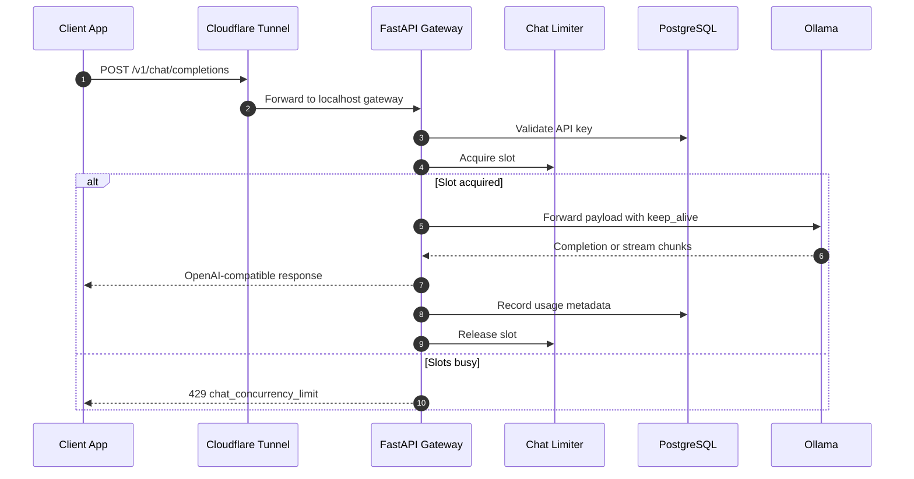

# System Diagrams

Use this page as the diagram source for blog posts, architecture-lab pages, presentations, and client walkthroughs. The topologies below are interactive, built with React Flow, and automatically positioned using ELK layouts.

## 1. Full System Topology

The system topology displays how client traffic routes through Cloudflare, enters the FastAPI gateway control plane, and connects securely to local databases and Ollama model lanes.

<InteractiveDiagram name="full-system-topology" />

## 2. Runtime Boundaries

This map details variables, KV caches, contexts, and timeouts that define the serving profiles inside macOS unified memory.

<InteractiveDiagram name="runtime-boundaries" />

## 3. Chat Request Sequence

The chat sequence outlines the synchronization loop between FastAPI, PostgreSQL key verification, and Ollama completion engines. This sequence is processed via standard Mermaid:

## 4. Concurrency and Backpressure

This model demonstrates the async queue slot limiter that shields Ollama from concurrent request spikes.

<InteractiveDiagram name="concurrency-backpressure" />

## 5. Unified Memory Model

This details how the 32 GB unified memory footprint is partitioned to prevent swapping or out-of-memory errors when local models run.

<InteractiveDiagram name="unified-memory-model" />

## 6. Security Control Map

The security blueprint displays the separation of public HTTPS tunnels, client-key auth, and the private Compose container network.

<InteractiveDiagram name="security-control-map" />

## 7. Dev vs Production Topology

A side-by-side comparison of local dev uvicorn ports and containerized production routing.

<InteractiveDiagram name="dev-vs-production-topology" />

## 8. Future Rate Limiting Design

The planned split rate-limiting strategy that distributes checks between the Cloudflare edge and per-API key Redis counters.

<InteractiveDiagram name="future-rate-limiting" />
